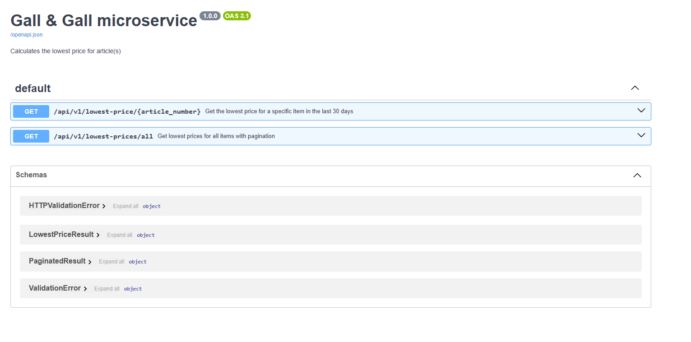

# GG.Utils

# Run locally:
1.
a. Run the following command: python -m uvicorn main:app --reload
b. Once the code is running, the easiest way to test is to navigate to "http://127.0.0.1:8000/docs#"
    to view the API documentation and test the solution. See image below of what you should see:

2. I've added a dockerfile you can build locally. Here are instructions:
a. Run the following to build the image: docker build -t gg:latest .
b. Run the following to start the container: docker run -d --name lowest-price -p 8000:8000 gg:latest

    Below are some test requests you can use once the container is running:

    - http://localhost:8000/api/v1/lowest-prices/all
    - http://localhost:8000/api/v1/lowest-price/691046
    - http://localhost:8000/api/v1/lowest-price/100080

# How would you deploy your solution? Describe your approach.
Once I have confirmed the container is working well I'd say it's ready for deployment. I would do the following:
- Build a release pipeline of some kind which would auto build the docker image and push to an artifact registry.
- The following step in the pipeline would be to have an approval stage for a QA environment, and a separate approval stage for Production.
- Once the stage is approved, the container would start in the associated environment.
- Hopefully, the cloud infrastructure would be set up in such a way to allow for a blue-green deploy. And all workers would restart and take into account the latest code.

# Document your solution in English.
This API is made with FastAPI. I implemented service orientated design pattern together with a data access object pattern. The DAO pattern works best when there is a dtabase to work with, but I wanted to "replicate" a database by using the CSV files. This means that the CSV files are loaded at the repository level.

Overview of src:
- models: I've placed my data models here which map to the CSV files. There are also DTO models which is purposefully used for output and to prevent all fields from being displayed. I used pydantic as that is the recommended data validation library to use when working with FastAPI. The "paginated_result" class is using generics so that it could hypothetically work with any model.
- repositories: there exists an interface for the repository. The methods are implemented in the csv_repository and also used in the service via dependency injection.
- services: price_service is where the magic happens. The business logic lives here and is essentially where the calculations are done to determine what the lowest cost is for a given article. The service is running as a singleton here but this would not work in a real-world environment. I did this so that the CSV file was not reloaded into memory with every request. This would naturally not be scalable.
- router: the endpoints have been implemented here.

  The main business logic to determine the lowest price was determined as follows:
  - Regardless of whether we are getting a specific article number, or ALL article numbers, we will be following the same process.
  - When an article number is looked up, the code will look up all the normal prices and promotion prices based on the article number
  - After that the code will proceed to filter out any values that are not valid for the last 30 days (based on the date specifed, today's date is the default)
  - It will then find the lowest price among the records that are left
  - This final result is what is chosen to represent the lowest price for the item/article and will be sent as a result.

Note:
- I did not end up implementing any async/awaits mostly because I don't think it's necessary given that we are working with a csv file adnd the service that does the calculations is a CPU bound task in any case. Even if I added async and await it would still run synchronously.

What would I do with more time?
- Add an Auth layer, using OAuth or JWT tokens for a security layer
- Adding the CSV files into a database of some kind, this will also allow me to work with async and await tasks
- Perhaps improved error handling and general improvements to account for the CAP theorem.